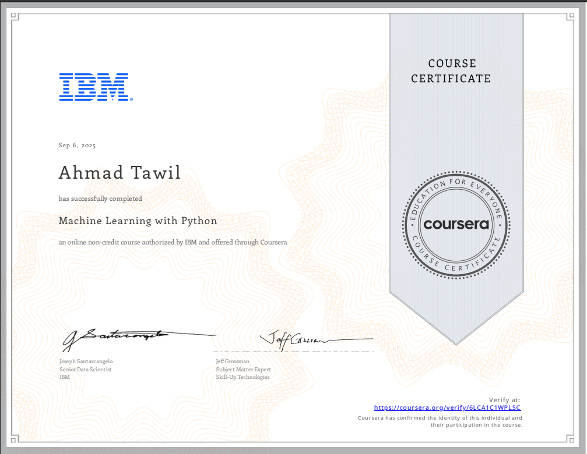

# IBM Machine Learning with Python 🎓

[🔗 Verify Certificate](https://coursera.org/verify/6LCA1C1WPLSC)

---

## 📘 About this Course
This repository contains my work, labs, and projects from the **IBM Machine Learning with Python** course, part of the **IBM AI Engineering Professional Certificate** on Coursera.  

The course covered the **end-to-end machine learning workflow**, from supervised and unsupervised learning to pipelines, evaluation, and real-world applications.

---

## 🗂️ Modules Overview  

### **Module 1: Introduction to Machine Learning**
- Types of ML: supervised, unsupervised, reinforcement  
- Linear Regression basics (CO₂ emissions prediction)  

### **Module 2: Regression Models**
- Multiple Linear Regression, Polynomial & Nonlinear Regression  
- Logistic Regression (binary classification)  
- Labs: Regression on automotive and logistic datasets  

### **Module 3: Classification Algorithms**
- Decision Trees & Regression Trees  
- Random Forests & XGBoost (ensemble methods)  
- Support Vector Machines (credit card fraud detection)  
- K-Nearest Neighbors (KNN classification)  

### **Module 4: Clustering & Dimensionality Reduction**
- K-Means clustering (customer segmentation)  
- DBSCAN vs. HDBSCAN (geospatial data)  
- PCA, t-SNE, UMAP (dimensionality reduction & visualization)  

### **Module 5: Model Evaluation & Validation**
- Metrics: Accuracy, Precision, Recall, F1, ROC-AUC  
- Cross-validation & stratified CV  
- Regularization (Ridge, Lasso)  
- Pipelines with GridSearchCV  

### **Module 6: Projects**
- **Practice Project**: Titanic survival prediction  
  - Preprocessing with `ColumnTransformer` (imputation, scaling, encoding)  
  - Models: Logistic Regression, Random Forest  
  - Addressed class imbalance with `class_weight="balanced"`  
  - Achieved ~0.82 F1-score  

- **Final Project**: Rainfall prediction (Melbourne dataset)  
  - Feature engineering (seasonal features, leakage removal)  
  - Pipeline + GridSearchCV for hyperparameter tuning  
  - Evaluated with ROC-AUC, precision, recall  
  - Found **Sunshine** & **Humidity3pm** most predictive  

---

## 🛠️ Skills Gained
- Machine Learning fundamentals with **Python & scikit-learn**  
- Building and evaluating **regression & classification models**  
- Handling **imbalanced datasets** (sample weights, class weighting)  
- **Unsupervised learning**: clustering & dimensionality reduction  
- **Pipelines** for reproducible ML workflows  
- Model evaluation with **cross-validation & metrics**  
- Feature engineering & data preprocessing  

---

## 📂 Repository Structure
├── Module2_Regression/
├── Module3_Classification/
├── Module4_Clustering/
├── Module5_Evaluation/
├── Projects(module6)/
│ ├── Titanic/
│ ├── Rainfall/
└── README.md

---

## 🚀 Next Steps
This course provided a strong foundation in classical ML.  
Next, I am applying these skills in **Deep Learning (Keras, CNNs, RNNs, Transformers)** as part of the broader IBM AI Engineering Certificate.  

---

✍️ **Author:** Ahmad Tawil  
📅 Completed: September 6, 2025  
